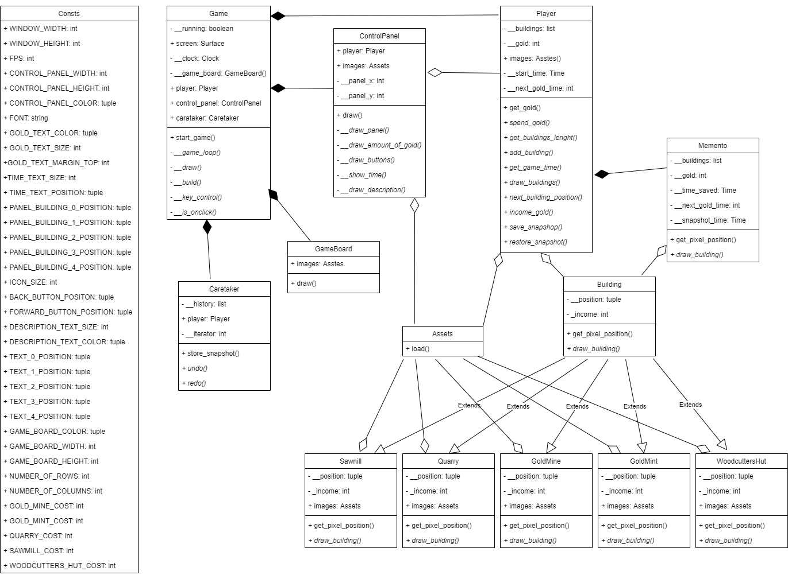
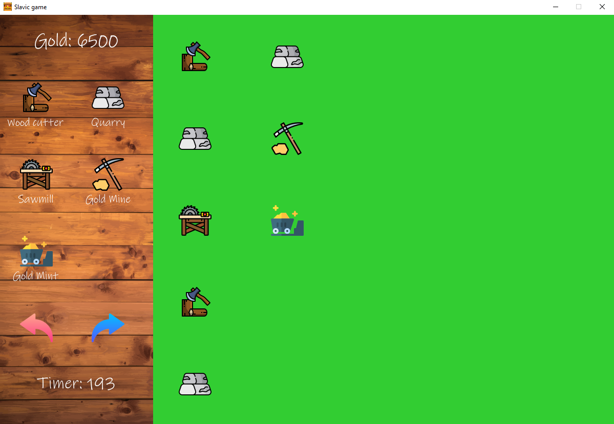

<!-- Heading -->
## Silesian Game
### Description
Simple Game in Python using paradigms of object oriented programming.
<!-- UL -->
Used project patterns:
* Snapshot, Memento
* Template Method
<!-- UL -->
#### Diagram Class UML

<!-- UL -->
##### Screenshot

